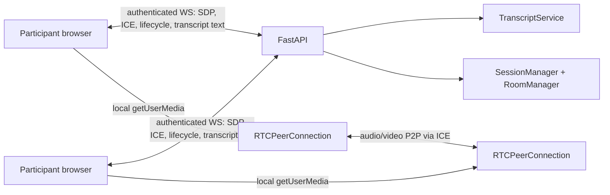
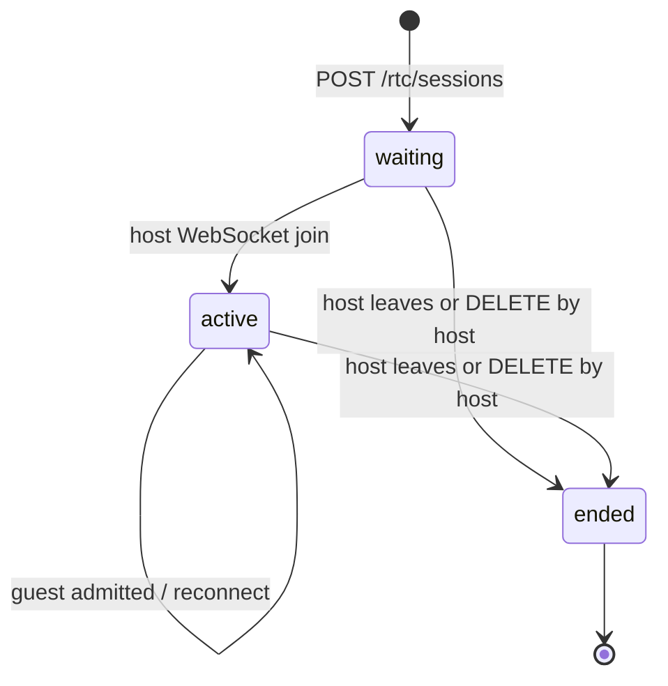

# Current meeting architecture

The repository implements a FastAPI signaling relay and browser peer-to-peer
media. FastAPI does not receive, decode, mix, or transcribe microphone audio.



`Pot/core/room.py` maintains in-process WebSocket peers and rooms. It relays
SDP and ICE only between admitted peers in the same meeting. `Pot/core/session.py`
is the meeting state machine (`waiting -> active -> ended`) and rejects joins
after termination. Because this state is in memory, `Pot/main.py` runs one
Uvicorn worker; a multi-instance deployment needs shared session state and
fan-out before it is safe to scale horizontally.

## Lifecycle



The REST create response includes a private host capability. A refreshed host
must present it in `join.host_token`; the old socket is detached. Guests resolve
a meeting code, connect with a new WebSocket peer ID, and remain in
`waiting_for_host` until the active host admits them. Host departure is
terminal, preventing stale sockets from reviving a meeting.

All room mutations are idempotent where possible. Duplicate joins do not add a
second participant. Disconnect cleanup removes admitted and waiting peers and is
safe to run after an explicit `leave`.

## Privacy and transcription

The default path never uploads `MediaRecorder` data. The legacy audio upload
endpoint returns `410 Gone`. Client ASR is isolated behind
`Tea/js/modules/transcription.js`; the browser-native adapter is opt-in because
browser vendors do not expose a reliable runtime guarantee that recognition is
offline. It emits text-only versioned events over the authenticated meeting
WebSocket. The backend validates meeting/participant identity, payload size,
event type, timing, and duplicate IDs, then broadcasts accepted events to
admitted subscribers. Partial events replace the prior partial for their
participant/session/sequence; finals replace any matching partial and are the
only committed event type.

The current repository has no account/login provider. A WebSocket-assigned peer
ID authenticates a live connection, meeting membership is established by host
admission, and the host capability protects host-only operations. Deployments
with user authentication should bind the peer ID to that identity before
exposing the API publicly.

## Operational constraints

- Copy the existing `Pot/.env` settings for `PROFILE`, application paths, and
  required database metadata; the meeting MVP itself does not open a database
  connection.
- Configure `STUN_SERVER`; configure `TURN_SERVER`, `TURN_USERNAME`, and
  `TURN_CREDENTIAL` for networks where STUN cannot establish a direct path.
- Do not run multiple workers or replicas with the current in-memory managers.
- No FFmpeg, MoviePy, broker, media server, or server-side ASR is required.

## Verification

```bash
.venv/bin/python -m pytest -q Pot/tests
node --check Tea/js/main.js
node --check Tea/js/modules/webrtcClient.js
node --check Tea/js/modules/transcription.js
```

The automated tests cover lifecycle transitions, duplicate/unauthorized room
operations, transcript partial/final semantics, and transcript identity
binding. Real browser media, TURN traversal, and offline ASR require target
devices and credentials that are not available in this repository environment.
