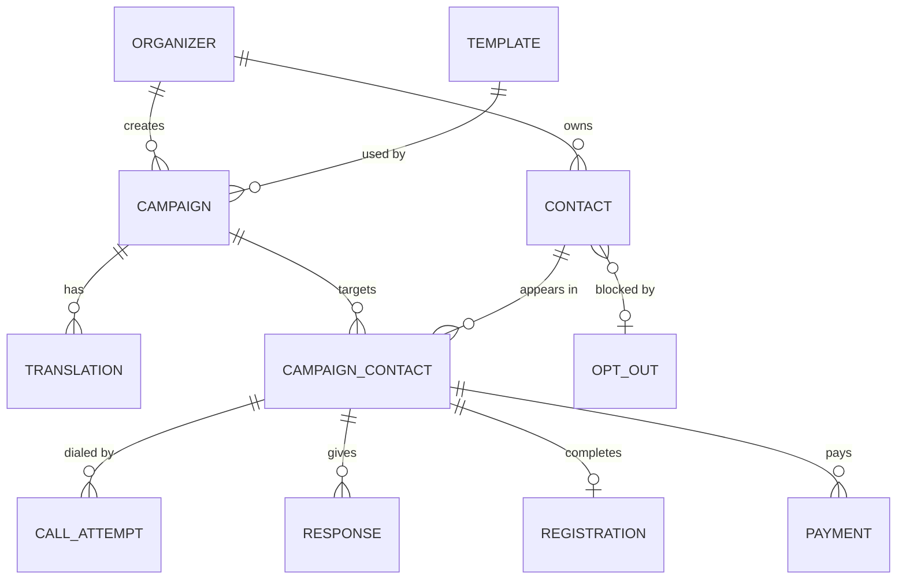

# EventReach data model v1

One contact record per person per organizer. One `campaign_contact` row per person per campaign.
That row is the single identity that calls, the registration page, and payments all attach to.

## Entities

| Table | What it holds | Notes |
|---|---|---|
| `organizers` | People who log in to the dashboard | Role: `organizer` or `admin` |
| `templates` | The four presets (seminar invite, clinic reminder, school notice, payment reminder) | Variables and keypad options are stored as JSON |
| `campaigns` | One run of a template with event details, languages and channels | Status: draft, ready, running, completed |
| `translations` | One row per campaign and language | Call script, voicemail script, email, WhatsApp text, social caption, back-translation, approved flag |
| `contacts` | A person, owned by an organizer | Phone stored encrypted (`phone_enc`) and as a salted hash (`phone_hash`) for matching |
| `campaign_contacts` | A person inside one campaign | Holds language, segment, stage, last outcome, registration token |
| `call_attempts` | Every call placed | Provider call id, status, duration, recording URL and delete-by date |
| `responses` | Every answer, on any channel | Keypad digit, spoken text, normalized outcome |
| `registrations` | The form a person completed | Consent timestamp is mandatory |
| `payments` | Payment orders and results | Gateway order id, amount, status |
| `opt_outs` | People who asked to stop | Matched by `phone_hash`, applies across all campaigns |
| `audit_log` | Who exported or viewed contact lists | Supports the privacy story |

## Shared vocabulary (use these exact words everywhere)

**Outcome** (what a call or reply ended as): `pending`, `confirmed`, `declined`, `callback`, `no_answer`, `voicemail`, `opted_out`, `wrong_number`, `failed`

**Stage** (how far a person has got): `invited` → `responded` → `registered` → `paid` → `attended`

**Channel**: `call`, `sms`, `email`, `whatsapp`, `instagram`

**Language codes**: `en`, `hi`, `ml`, `ta` (add more as needed)

## Rules that keep the data clean

1. A person is unique by `phone_hash` within an organizer, so uploading the same number twice merges instead of duplicating.
2. Opt-out is checked against `opt_outs` before every call or message, in every campaign.
3. The API never returns a full phone number. Responses carry `phone_masked` only.
4. Stage only moves forward, except when the organizer corrects it by hand.
5. `last_outcome` is derived from the newest `responses` row. The dashboard reads outcomes and stages only.
6. Recordings have a `delete_after` date, and a daily job removes them.

The runnable version of this is `db/schema.sql`.
